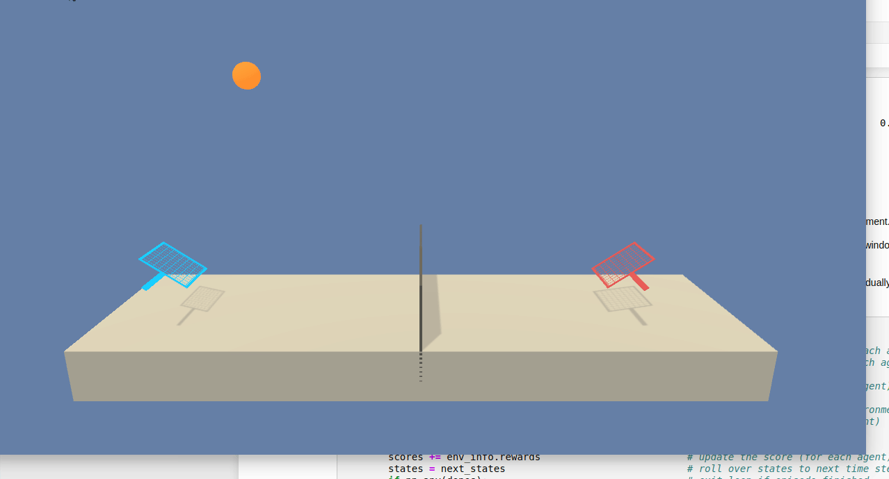
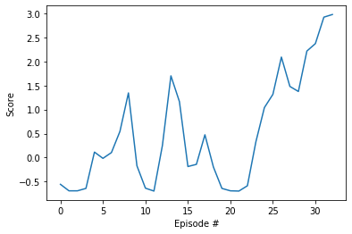
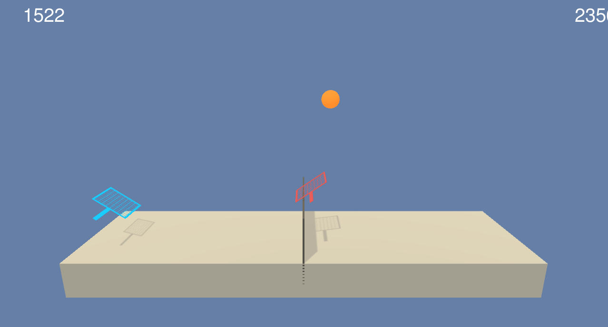

# Deep Reinforcement Learning Project 3: Collaboration and Competition


I have explored the details from the [CONTINUOUS CONTROL WITH DEEP REINFORCEMENTLEARNING](https://arxiv.org/pdf/1509.02971.pdf) 
Then revisited the the Udacity repo [DDPG-Bipedal](https://github.com/udacity/deep-reinforcement-learning/tree/master/ddpg-bipedal) .

My solution implements an adaptation of Multi-Agent Deep Deterministic Policy Gradients (MADDPG) algorithm as proposed by Lowe, Ryan, et al. "Multi-agent actor-critic for mixed cooperative-competitive environments." for the collaborative self-play agent. Adapted the code from the repo, tried to tweak various hyperparameters. Solved the project on my GPU laptop.

### 1. Started the Unity enviornment:
```
env = UnityEnvironment(file_name="./Tennis_Linux/Tennis.x86_64")
```
Environments contain brains which are responsible for deciding the actions of their associated agents. Here we check for the first brain available, and set it as the default brain we will be controlling from Python.

### 2. Examine the State and Action Spaces

In this environment, two agents control rackets to bounce a ball over a net. If an agent hits the ball over the net, it receives a reward of +0.1. If an agent lets a ball hit the ground or hits the ball out of bounds, it receives a reward of -0.01. Thus, the goal of each agent is to keep the ball in play.

The observation space consists of 8 variables corresponding to the position and velocity of the ball and racket. Two continuous actions are available, corresponding to movement toward (or away from) the net, and jumping.

Run the code cell below to print some information about the environment.

### 3. Take Random Actions in the Environment

Explored how to use the Python API to control the agent and receive feedback from the environment. Watched the agent's performance, if it selects an action at random with each time step.

<p align=center></p>

### 4. Learning Algorithm

The learn method updates actor and critic model based on experiences (transitions) from all agents at the same time:

- A batch of transitions is sampled from the replay buffer.
- Update online critic model
	- Compute actions for the next states with the target actor model
	- Compute Q-values for the next states and actions with the target critic model
	- Compute target Q-values for the current states and actions using the Bellman equation
	- Compute Q-values for the current states and actions with the online critic model
	- Use the target and online Q-values to compute the loss
	- Minimize the loss for the online critic model
- Update online actor model
	- Compute actions for current states with the online actor model
	- Compute Q-values with the online critic model
	- Use the Q-values to compute the loss
	- Minimize the loss for the online actor model
	- Soft update of the target critic and actor models
- Training of the agent is implemented in the run function, which has the following flow
	- Every timestep, the environment provides states as observed by each agent
	- The agent computes actions for these states.
	- Given the actions, the environment provides next states, rewards and whether the episode is completed for each agent.
	- States, actions, next states and the rewards constitute the transition that is added to replay buffer.

### 5. Model for agent and neural network
Agent Class was created in the multi_ddpg_agent.py file. It contains config parameters as mentioned below:

- actor_learning_rate = 1e-4
- critic_learning_rate = 3e-4 
- gamma = 0.99            # discount factor
- tau = 1e-3              # for soft update of target parameters
- actor_learning_rate = 1e-4         # learning rate of the actor 
- critic_learning_rate = 3e-4         # learning rate of the critic
- weight_decay = 0.0001 # L2 weight decay

Agent class has step function which evaluates step value functions using deep learning models. Act fuction for the agent selects action for the given state. Action selection process also trained using the deep learning model and hence decoupled from the step-value evaluation.

- 2 hidden layers with 256 and 128 hidden units for both actor and critic
- Shared replay buffer
- Replay batch size 256
- Buffer size 1e6
- Update frequency 4
- Learning rate 1e-4 for actor and 3e-4 for critic
- Ornstein-Uhlenbeck noise

While training the agent tweaked some of the parameters. It was found that model is much sennsitive to the number of hidden units and weight decay. With hidden units more than (256,128) and with learning rate of more than 2e-4 model behaved slow. Weight decay of 0.0001 helped to speed up the training at least by 25 percent as compared to weight decay of zero. 
Batch size of 128 and 64 has not helped to speed up the training. Weight decay smaller than 0.0001 not only made training slower, but also considerably unstable. Sigma for noise also played cosiderable part in the training, sigma= 0.1 helped to make model more stable and faster as compared to sigma=0.2. Update frequency of more than 4 slows the model considerably.

### 6. Results

Environment solved in 28 episodes!	Average Score: 0.50

<p align=center></p>


### 7. Watch a Smart Agent!
Loaded the trained weights from saved file to watch a smart agent!
<p align=center></p>

### 8. Ideas for Future Work
As mentioned in the course lectures, Proximal Policy Optimization (PPO) and Distributed Distributional Deterministic Policy Gradients (D4PG) methods are expected to give a performance boost.


